# Strategic Implementation Roadmap — Canonical ITAD Data Model

Audience: Product / Engineering / Ops / Compliance

## Executive Summary
We are building a canonical ITAD data model that preserves compliance truth, prevents split-brain between systems, and delivers auditable operations from intake to settlement. The roadmap enforces System-of-Record (SoR) boundaries so only one system writes each domain while others read or snapshot data. This enables immutable anchors (receiving), append-only events (gates, custody), and controlled integrations without conflicting edits.

## Governance & Architecture Principles
- **System-of-Record (SoR) principle:** single-writer per domain with immutable anchors and append-only events.
  - Odoo is SoR for scheduling/work orders/day routes/stops/dispatch execution.
  - ITAD Core is SoR for compliance + facility truth: BOL, Receiving Weight Record v3 (immutable), processing sessions, reconciliation/disputes, evidence/custody, lots/LPN, shipments, disposition, certificates, settlement.
  - Routific is optimizer-only (advisory proposals; stored/versioned in Odoo).
  - Acceptance/dispatch commits to Odoo; ITAD Core receives compliance artifacts later via pickup_manifest -> BOL -> receiving...
- **Integration invariants:** Idempotency-Key header on create endpoints, correlation IDs on requests, external_id_map for cross-system IDs, and snapshot rules to prevent drift.
- **Data integrity invariants:** receiving immutability (void/reissue only), append-only gates, and taxonomy hard rule (processing lines must reference taxonomy_item_id; no free-text categories).

## Phased Roadmap

### Pre-Phase 0: Planning & Discovery
- **Goals:** Define scope, SoR boundaries, success metrics, and compliance constraints.
- **Key Deliverables:** Architecture brief; stakeholder alignment; initial risk register.
- **Entry Criteria / Dependencies:** Executive sponsorship; compliance sign-off on SoR policy.
- **Exit Criteria / Sign-off Checklist:** SoR statement approved; integration invariants accepted.
- **SoR Impact:** No system changes; policy alignment only.
- **Risks + Mitigations:** Scope creep -> timeboxed discovery; unclear ownership -> SoR matrix review.

### Phase 0: Canonical Model Lock (A–I)
**Purpose:** Lock data model and governance rules before integrations begin. Must align with `tasks.md` checklist items 1-30.

#### A) Architecture & Ownership (Items 1-4)
- **Goals:** Unambiguous SoR and ownership boundaries.
- **Key Deliverables:** PHASE_0 docs; SoR matrix; glossary.
- **Entry Criteria:** Pre-Phase 0 sign-off.
- **Exit Criteria:** Items 1-4 checked in `tasks.md`.
- **SoR Impact:** Odoo vs ITAD Core responsibilities locked.
- **Risks + Mitigations:** Conflicting ownership -> enforce single-writer rule.

#### B) Identifiers & Versioning (Items 5-8)
- **Goals:** Consistent IDs, unique keys, and snapshot/version policies.
- **Key Deliverables:** BOL uniqueness, external_id_map, requirement profile snapshots.
- **Entry Criteria:** Architecture lock.
- **Exit Criteria:** Items 5-8 checked in `tasks.md`.
- **SoR Impact:** Canonical ID and versioning rules in ITAD Core.
- **Risks + Mitigations:** ID collisions -> enforce UUID + unique constraints.

#### C) Workflow (Gates, Stages, Closure) (Items 9-12)
- **Goals:** Append-only workflow gates and closure logic.
- **Key Deliverables:** Gate list, transition matrix, closure blockers.
- **Entry Criteria:** Identifiers locked.
- **Exit Criteria:** Items 9-12 checked in `tasks.md`.
- **SoR Impact:** ITAD Core owns gate progression; Odoo reads derived state.
- **Risks + Mitigations:** Invalid transitions -> strict validation.

#### D) Receiving Anchor (Immutable) (Items 13-16)
- **Goals:** Immutable receiving anchor with correction policy.
- **Key Deliverables:** Receiving Weight Record v3 fields, void/reissue endpoints, tare policy, blind receiving.
- **Entry Criteria:** Workflow gates defined.
- **Exit Criteria:** Items 13-16 checked in `tasks.md`.
- **SoR Impact:** Receiving anchors are immutable in ITAD Core.
- **Risks + Mitigations:** Data tampering -> forbid updates/deletes.

#### E) Processing Domains & Taxonomy (Items 17-20)
- **Goals:** Session+lines processing model with taxonomy governance.
- **Key Deliverables:** Taxonomy (Group/Type/Variant), session/line schemas, sb20_flag.
- **Entry Criteria:** Receiving anchor defined.
- **Exit Criteria:** Items 17-20 checked in `tasks.md`.
- **SoR Impact:** ITAD Core owns processing truth; no free-text categories.
- **Risks + Mitigations:** Taxonomy drift -> effective-dated changes only.

#### F) Reconciliation & Disputes (Items 21-23)
- **Goals:** Reconciliation thresholds and dispute workflow.
- **Key Deliverables:** Variance rules, dispute statuses, closure blocks.
- **Entry Criteria:** Processing model defined.
- **Exit Criteria:** Items 21-23 checked in `tasks.md`.
- **SoR Impact:** ITAD Core controls reconciliation state.
- **Risks + Mitigations:** Unapproved closures -> enforce blockers.

#### G) Evidence & Chain of Custody (Items 24-26)
- **Goals:** Evidence artifacts and custody event policy.
- **Key Deliverables:** Artifact model, link structure, custody event rules.
- **Entry Criteria:** Dispute model defined.
- **Exit Criteria:** Items 24-26 checked in `tasks.md`.
- **SoR Impact:** ITAD Core is authoritative for custody/evidence.
- **Risks + Mitigations:** Missing artifacts -> required types list.

#### H) Inventory, Outbound, Downstream (Items 27-29)
- **Goals:** Inventory model and outbound shipment domain.
- **Key Deliverables:** LPN/lot/location models, outbound shipment artifacts, downstream chain.
- **Entry Criteria:** Evidence model defined.
- **Exit Criteria:** Items 27-29 checked in `tasks.md`.
- **SoR Impact:** ITAD Core owns inventory and outbound truth.
- **Risks + Mitigations:** Incomplete traceability -> enforce artifact links.

#### I) Variant A Integrations (Pickup Manifest bridge) (Item 30)
- **Goals:** Define pickup_manifest bridge and binding rules.
- **Key Deliverables:** Bridge spec, binding to BOL(source_type=PICKUP), geocode policy.
- **Entry Criteria:** Inventory/outbound domain defined.
- **Exit Criteria:** Item 30 checked in `tasks.md`.
- **SoR Impact:** Odoo writes acceptance/dispatch; ITAD Core receives compliance artifacts later via pickup_manifest -> BOL -> receiving...
- **Risks + Mitigations:** Integration drift -> external_id_map + snapshots.

### Phase 1: Integration Buildout (Blocked until Phase 0 complete)
- **Goals:** Implement Odoo <-> ITAD Core integration flows and Routific proposal handling.
- **Key Deliverables:** Pickup manifest integration, external ID wiring, operational sync.
- **Entry Criteria / Dependencies:** Phase 0 items 1-30 checked in `tasks.md`.
- **Exit Criteria / Sign-off Checklist:** Integration tests pass; compliance sign-off; Ops training complete.
- **SoR Impact:** Odoo commits scheduling/dispatch; ITAD Core receives compliance artifacts later via pickup_manifest -> BOL -> receiving...
- **Risks + Mitigations:** Split-brain risk -> strict SoR enforcement and idempotency.

### Phase 2: Operationalization & Reporting
- **Goals:** Dashboards, compliance reporting, and operational KPIs.
- **Key Deliverables:** Reports, audit extracts, alerting.
- **Entry Criteria:** Phase 1 integration stable.
- **Exit Criteria:** Reporting accuracy validated by Compliance and Ops.
- **SoR Impact:** Reporting reads ITAD Core compliance truth.
- **Risks + Mitigations:** Data quality gaps -> reconciliation checks.

### Phase 3: Scale, Hardening, Multi-site, Audit Readiness
- **Goals:** Performance, access control, multi-site support, audit prep.
- **Key Deliverables:** Security controls, backups, audit artifacts.
- **Entry Criteria:** Stable operations.
- **Exit Criteria:** Security/Compliance approval; load tests pass.
- **SoR Impact:** SoR boundaries unchanged; stronger governance.
- **Risks + Mitigations:** Security gaps -> regular reviews and penetration tests.

### Phase 4: Cutover / Migration / Decommission Legacy
- **Goals:** Migrate legacy data and retire old processes safely.
- **Key Deliverables:** Migration plan, data validation, decommission checklist.
- **Entry Criteria:** Phase 3 readiness complete.
- **Exit Criteria:** Legacy systems read-only or retired; post-cutover audit complete.
- **SoR Impact:** ITAD Core becomes canonical for compliance data.
- **Risks + Mitigations:** Data loss -> staged migrations and backups.

## Milestones and Gates
- **Phase 1 BLOCKED until Phase 0 checklist items 1-30 are checked in `tasks.md`.**
- Sign-off roles per milestone: Ops Lead, Compliance, Engineering TL, QA.

## Resource Allocation (RACI Summary)
| Role | Pre-Phase 0 | Phase 0 | Phase 1 | Phase 2 | Phase 3 | Phase 4 |
| --- | --- | --- | --- | --- | --- | --- |
| Solution Architect | A | A | C | C | C | C |
| Backend | R | R | R | C | C | C |
| Odoo Dev | C | C | R | C | C | C |
| QA | C | C | R | R | R | C |
| Data/Reporting | C | C | C | R | C | C |
| Security/Compliance | A | A | C | C | R | C |
| Ops SMEs | C | C | C | R | C | A |

Legend: R = Responsible, A = Accountable, C = Consulted, I = Informed (implicit for all phases).

## Phase Flow (Mermaid)

```mermaid
flowchart LR
    P0[Pre-Phase 0: Planning & Discovery] --> A[Phase 0.A Ownership]
    A --> B[Phase 0.B Identifiers]
    B --> C[Phase 0.C Gates & Closure]
    C --> D[Phase 0.D Receiving Anchor]
    D --> E[Phase 0.E Processing & Taxonomy]
    E --> F[Phase 0.F Reconciliation]
    F --> G[Phase 0.G Evidence & Custody]
    G --> H[Phase 0.H Inventory & Outbound]
    H --> I[Phase 0.I Pickup Manifest Bridge]
    I --> P1[Phase 1: Integration Buildout]
    P1 --> P2[Phase 2: Operationalization & Reporting]
    P2 --> P3[Phase 3: Scale & Hardening]
    P3 --> P4[Phase 4: Cutover / Migration]
```

## Cross-References
- Phase 0 master checklist: tasks.md
- Phase 0 canonical docs: docs/phase0/PHASE_0.md
- Phase 0 lock review: docs/phase0/PHASE_0_LOCK_REVIEW.md
- Glossary: docs/phase0/glossary.md
- Object map: docs/phase0/object_map.md
